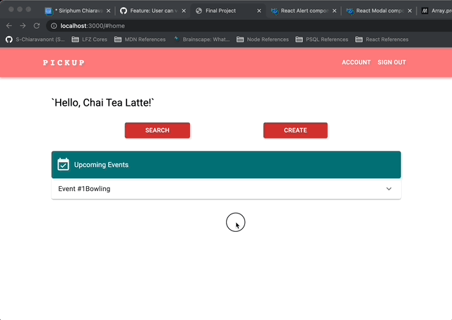

# Pick-Up-Sports

A full stack application for anyone looking for pick-up sports in their community.

I built this project because lately, I've been meeting new people and making new friends at local climbing gyms and the only thing we use to communicate is through FB messages. I've wanted to create an application where we can do more than just chatting but also have an event set up for convenience.

Live Demo:
https://pick-up-sports.siriphumchiaravanont.com/

The application is built on:
- React
- Node.js
- Express.js
- PostgreSQL

Dependencies:
- Babel
- webpack
- nodemon
- linter/eslint/markuplint
- livereload/connect-livereload
- pg
- dotenv

Other packages:
- Argon2 (https://www.npmjs.com/package/argon2)
- JsonWebToken (https://www.npmjs.com/package/jsonwebtoken)
- jwt-decode (https://www.npmjs.com/package/jwt-decode)
- Material UI (https://mui.com/)
- Google Maps API (https://developers.google.com/maps/documentation/javascript)
- Google Place Autocomplete API (https://developers.google.com/maps/documentation/places/web-service/autocomplete)
- Google Maps Geocoding API (https://developers.google.com/maps/documentation/geocoding)
- @react-google-maps/api (https://www.npmjs.com/package/@react-google-maps/api)
- use-places-autocomplete (https://www.npmjs.com/package/use-places-autocomplete)
- dayjs (https://www.npmjs.com/package/dayjs)
- moment (https://www.npmjs.com/package/moment)
- @date-io/core (https://www.npmjs.com/package/@date-io/core)

Working features:
- Sign up
- Log in/log out
- Edit user profile
- View home page (upcoming event(s))
- Create new event
- Edit event
- Search for event
- Join/unjoin event

 / ! 

Upcoming features:
- Accept join request
- Comment on event
- Messaging (peer to peer)

Requirements for developers that would like to run the code on their personal computer
- Node.js
- PostgreSQL (database)
- Google APIs (maps, places, geocoding needed to be activated)

How to get started:
- Installing all dependencies using `npm`
- Create `.env` file with terminal command line `cp .env.example .env
`
- Change ALL `changeMe` value within `.env` file to anything. `TOKEN_SECRETE` and `DATABASE_URL`
- Create a new variable name `NEXT_PUBLIC_GOOGLE_MAPS_API_KEY` set it to your Google Maps API key
- Follow (https://mapsplatform.google.com/?utm_source=search&utm_medium=googleads&utm_campaign=brand_core_exa_desk_mobile_us&gclid=Cj0KCQiAw8OeBhCeARIsAGxWtUwm9D4ehXWQPU98KKgKqqwPVOmIGCD495Ud41C6U1D_xqG2A0N9l-oaAt-GEALw_wcB&gclsrc=aw.ds) to get started with Google APIs
- Make sure your `postgresql` is running by checking the status `sudo service postgresql status`
- If the database is offline then start the server with this command `sudo service postgresql start`
- Run this command in your terminal to crete a database `createdb yourDataBaseName`
- Run this command to import the database schema `npm run db:import`
- Double check that the database schema is imported by running this command `pgweb --db=yourDataBaseName` and open a browser to `http://localhost:8081`
- Once database is running, run the command `npm run dev` in the terminal to start the application in development mode. You can open a browser to `http://localhost:3000` to start interacting with the web application.
